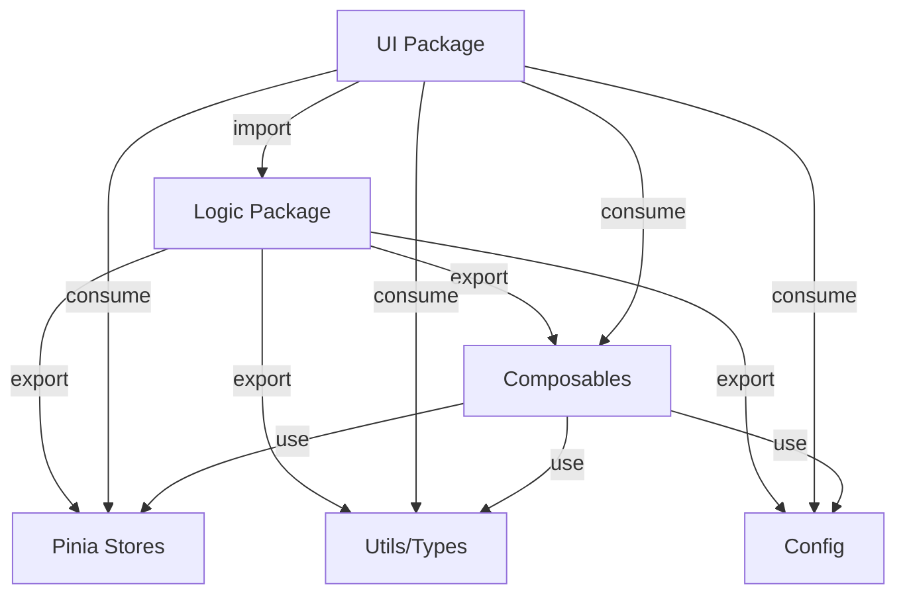

# Arquitectura del Monorepo Multi-Marca

**Fecha:** 2026-01-20
**Proyecto:** rentacar-main (alquilatucarro.com)
**Versión:** 1.0.0

---

## Tabla de Contenidos

1. [Visión General](#1-visión-general)
2. [Estructura del Monorepo](#2-estructura-del-monorepo)
3. [Package: Logic](#3-package-logic)
4. [Packages: UI](#4-packages-ui)
5. [Flujos de Datos](#5-flujos-de-datos)
6. [Patrones y Convenciones](#6-patrones-y-convenciones)
7. [Gestión de Dependencias](#7-gestión-de-dependencias)
8. [Build y Deploy](#8-build-y-deploy)
9. [Testing](#9-testing)
10. [Escalabilidad](#10-escalabilidad)

---

## 1. Visión General

### 1.1. Problema que Resuelve

**Antes (3 Branches):**
```
main (alquilatucarro) ──┐
                        ├─> Merge hell
alquilame ──────────────┤   4-6 horas/semana
                        │   Bugs por inconsistencia
alquicarros ────────────┘
```

**Después (Monorepo):**
```
packages/logic ──────┬──> ui-alquilatucarro
                     ├──> ui-alquilame
                     └──> ui-alquicarros

✅ 1 cambio → 3 marcas actualizadas
✅ Zero conflictos
✅ Consistency garantizada
```

### 1.2. Principios Arquitectónicos

| Principio | Descripción | Beneficio |
|-----------|-------------|-----------|
| **Separación de Responsabilidades** | Lógica ≠ Presentación | Mantenibilidad |
| **DRY (Don't Repeat Yourself)** | Lógica compartida en un solo lugar | Consistency |
| **Single Source of Truth** | Estado global unificado | Sin divergencia |
| **Progressive Enhancement** | UI específica por marca | Flexibilidad |
| **Type Safety** | TypeScript estricto | Confiabilidad |

### 1.3. Stack Tecnológico

| Capa | Tecnología | Versión |
|------|------------|---------|
| **Monorepo** | pnpm workspaces | 9.0+ |
| **Framework** | Nuxt 3 | 4.1.3 |
| **Runtime** | Vue 3 | 3.5.22 |
| **Estado** | Pinia | 3.0.3 |
| **UI** | Nuxt UI | 4.2.1 |
| **SEO** | @nuxtjs/seo | 3.2.2 |
| **Content** | @nuxt/content | 3.10.0 |
| **Hosting** | Firebase Hosting | - |
| **TypeScript** | TypeScript | 5.9.3 |

---

## 2. Estructura del Monorepo

### 2.1. Árbol de Directorios

```
rentacar-main/
├── package.json                    # Root package - Scripts globales
├── pnpm-workspace.yaml            # Workspace config
├── pnpm-lock.yaml                 # Lockfile unificado
├── .gitignore
├── README.md
├── MIGRATION.md
├── docs/
│   ├── architecture.md            # Este documento
│   ├── development-guide.md       # Guía de desarrollo
│   ├── deployment.md              # Guía de deployment
│   └── migration/
│       └── audit-results.md       # Auditoría de migración
├── .github/
│   └── workflows/
│       ├── ci.yml                 # Pipeline de CI
│       └── deploy.yml             # Pipeline de deploy
└── packages/
    ├── logic/                     # 🧠 Lógica compartida
    │   ├── package.json
    │   ├── tsconfig.json
    │   └── src/
    │       ├── index.ts
    │       ├── composables/       # Composables de negocio
    │       ├── stores/            # Pinia stores
    │       ├── utils/             # Utilidades y types
    │       ├── config/            # Configuración compartida
    │       ├── middleware/        # Middleware compartido
    │       └── server/            # Server utils (si aplica)
    ├── ui-alquilatucarro/        # 🎨 Marca 1
    │   ├── package.json
    │   ├── nuxt.config.ts
    │   ├── tsconfig.json
    │   ├── tailwind.config.ts
    │   ├── firebase.json
    │   ├── .env.example
    │   ├── app/
    │   │   ├── app.config.ts      # Config específica de marca
    │   │   ├── app.vue
    │   │   ├── error.vue
    │   │   ├── components/        # Componentes UI
    │   │   ├── pages/             # Páginas
    │   │   ├── layouts/           # Layouts
    │   │   ├── middleware/        # Middleware específico
    │   │   ├── assets/            # Assets (CSS, etc)
    │   │   └── plugins/           # Plugins Vue
    │   ├── server/                # Server routes
    │   └── public/                # Static assets
    ├── ui-alquilame/             # 🎨 Marca 2
    │   └── ... (misma estructura)
    └── ui-alquicarros/           # 🎨 Marca 3
        └── ... (misma estructura)
```

### 2.2. Responsabilidades por Package

| Package | Responsabilidad | Consumidores |
|---------|----------------|--------------|
| `@rentacar-main/logic` | Lógica de negocio, estado, tipos, utils | Todos los UI packages |
| `ui-alquilatucarro` | Presentación marca alquilatucarro.com | Usuarios finales |
| `ui-alquilame` | Presentación marca alquilame.com | Usuarios finales |
| `ui-alquicarros` | Presentación marca alquicarros.com | Usuarios finales |

---

## 3. Package: Logic

### 3.1. Propósito

**Qué contiene:**
- ✅ Lógica de negocio (composables)
- ✅ Estado global (Pinia stores)
- ✅ Tipos TypeScript
- ✅ Utilidades puras
- ✅ Configuración compartida
- ✅ Middleware compartido

**Qué NO contiene:**
- ❌ Componentes Vue (.vue)
- ❌ Páginas
- ❌ Layouts
- ❌ Assets estáticos
- ❌ Configuración de UI/tema

### 3.2. Estructura Interna

```
packages/logic/src/
├── index.ts                       # Barrel export principal
├── composables/
│   ├── index.ts                   # Re-export todos los composables
│   ├── api/                       # API calls
│   │   ├── useFetchCategoriesAvailabilityData.ts
│   │   ├── useFetchRentacarData.ts
│   │   └── index.ts
│   ├── business/                  # Lógica de negocio
│   │   ├── useCategory.ts
│   │   ├── useVehicleCategories.ts
│   │   ├── useSearch.ts
│   │   ├── useRecordReservationForm.ts
│   │   └── index.ts
│   ├── content/                   # Contenido dinámico
│   │   ├── useCityContent.ts
│   │   ├── useCityFAQs.ts
│   │   ├── useCityRelations.ts
│   │   └── index.ts
│   ├── seo/                       # SEO utilities
│   │   ├── useBaseSEO.ts
│   │   ├── useCityPageSEO.ts
│   │   ├── useSearchPageSEO.ts
│   │   ├── useBreadcrumbs.ts
│   │   └── index.ts
│   ├── schema/                    # Schema.org structured data
│   │   ├── useAggregateRating.ts
│   │   ├── useCityProductSchema.ts
│   │   ├── useLocalBusiness.ts
│   │   ├── useProductSchema.ts
│   │   ├── usePromotionSchema.ts
│   │   ├── useVideoSchema.ts
│   │   └── index.ts
│   └── utils/                     # Composables utilitarios
│       ├── useMessages.ts
│       ├── useMoneyFormat.ts
│       ├── usePhoneField.ts
│       ├── useData.ts
│       ├── useDefaultRouteParams.ts
│       ├── useSearchByRouteParams.ts
│       └── index.ts
├── stores/
│   ├── index.ts
│   ├── useStoreSearchData.ts
│   ├── useStoreReservationForm.ts
│   └── useStoreAdminData.ts
├── utils/
│   ├── index.ts
│   └── types/
│       ├── index.ts
│       ├── data/                  # Data types (API responses)
│       │   ├── CategoryAvailabilityData.ts
│       │   ├── BranchData.ts
│       │   ├── CategoryData.ts
│       │   └── ... (12 archivos)
│       ├── type/                  # Domain types
│       │   ├── City.ts
│       │   ├── CategoryType.ts
│       │   ├── Faq.ts
│       │   └── ... (9 archivos)
│       └── fields/                # Form field types
│           ├── FormFields.ts
│           ├── FormRecordFields.ts
│           └── FormSubmitFields.ts
├── config/
│   ├── index.ts
│   ├── cities.ts                  # Lista de ciudades
│   ├── faqs.ts                    # FAQs por ciudad
│   ├── vehicleCategories.ts       # Categorías de vehículos
│   ├── insuranceTypes.ts          # Tipos de seguro
│   ├── identificationTypes.ts     # Tipos de identificación
│   └── monthlyMileages.ts         # Kilometrajes mensuales
├── middleware/
│   ├── index.ts
│   ├── validateCityParams.ts
│   └── validateSearchParams.ts
└── server/                        # (Opcional) Server utilities
    └── api/
        └── ... (si hay lógica compartida)
```

### 3.3. Exports Principales

**`packages/logic/src/index.ts`:**
```typescript
// Re-export todo para consumo fácil
export * from './composables'
export * from './stores'
export * from './utils'
export * from './config'
export * from './middleware'
```

**Ejemplo de uso en UI package:**
```typescript
// Auto-importado (gracias a Nuxt auto-imports)
const { categories } = useVehicleCategories()

// O import explícito
import { useSearch } from '@logic/composables/business/useSearch'
import type { City } from '@logic/utils/types/type/City'
import { cities } from '@logic/config/cities'
```

### 3.4. Configuración

**`packages/logic/package.json`:**
```json
{
  "name": "@rentacar-main/logic",
  "version": "1.0.0",
  "type": "module",
  "main": "./src/index.ts",
  "types": "./src/index.ts",
  "exports": {
    ".": "./src/index.ts",
    "./composables": "./src/composables/index.ts",
    "./composables/*": "./src/composables/*/index.ts",
    "./stores": "./src/stores/index.ts",
    "./utils": "./src/utils/index.ts",
    "./config": "./src/config/index.ts",
    "./middleware": "./src/middleware/index.ts"
  },
  "peerDependencies": {
    "vue": "^3.5.0",
    "@pinia/nuxt": "^0.11.0",
    "nuxt": "^4.1.0"
  }
}
```

---

## 4. Packages: UI

### 4.1. Propósito

**Qué contiene cada UI package:**
- ✅ Componentes Vue (.vue)
- ✅ Páginas
- ✅ Layouts
- ✅ Assets específicos de marca (logos, imágenes)
- ✅ Configuración de tema/colores
- ✅ Configuración de marca (franchise)
- ✅ Middleware específico (si aplica)

**Qué NO contiene:**
- ❌ Lógica de negocio
- ❌ Stores Pinia
- ❌ Composables de negocio
- ❌ Tipos compartidos

### 4.2. Estructura Interna (ui-alquilatucarro)

```
packages/ui-alquilatucarro/
├── package.json
├── nuxt.config.ts                 # Configuración Nuxt
├── tsconfig.json
├── tailwind.config.ts             # Configuración Tailwind
├── firebase.json                  # Configuración Firebase
├── .env.example
├── .env.local                     # Dev env (gitignored)
├── .env.prod                      # Prod env (gitignored)
├── app/
│   ├── app.config.ts              # Config de marca + datos compartidos
│   ├── app.vue                    # Root component
│   ├── error.vue                  # Error page
│   ├── components/
│   │   ├── Carrusel.vue
│   │   ├── CategoryCard.vue
│   │   ├── CategorySelectionSection.vue
│   │   ├── CategoryTags.vue
│   │   ├── ChatWidget.vue
│   │   ├── CityPage.vue
│   │   ├── Logo.vue               # Logo específico de marca
│   │   ├── ReservationForm.vue
│   │   ├── ReservationFormSection.vue
│   │   ├── ReservationResume.vue
│   │   ├── Searcher.vue
│   │   ├── SelectBranch.vue
│   │   ├── Hero/
│   │   │   └── ... (Hero sections específicas)
│   │   ├── Icons/
│   │   ├── Images/                # Imágenes específicas
│   │   ├── Placeholders/
│   │   └── seo/
│   ├── pages/
│   │   ├── index.vue              # Home
│   │   ├── [city]/
│   │   │   └── index.vue
│   │   ├── blog/
│   │   │   ├── index.vue
│   │   │   └── [...slug].vue
│   │   ├── seo/
│   │   │   ├── index.vue
│   │   │   ├── competidores.vue
│   │   │   └── ... (más páginas SEO)
│   │   ├── reservado/
│   │   ├── pendiente.vue
│   │   ├── sindisponibilidad.vue
│   │   ├── terminos-condiciones.vue
│   │   ├── politica-privacidad.vue
│   │   └── gana/
│   ├── layouts/
│   │   ├── default.vue
│   │   └── ... (otros layouts)
│   ├── middleware/
│   │   └── ... (middleware específico, si aplica)
│   ├── assets/
│   │   └── css/
│   │       └── tailwind.css
│   └── plugins/
│       └── ... (plugins Vue específicos)
├── server/
│   └── api/
│       └── ... (server routes)
└── public/
    ├── favicon.ico
    ├── logo.png                   # Logo estático
    ├── robots.txt
    └── ... (assets estáticos)
```

### 4.3. Configuración Nuxt

**`packages/ui-alquilatucarro/nuxt.config.ts`:**
```typescript
export default defineNuxtConfig({
  // Compatibilidad
  compatibilityDate: '2024-11-01',

  // Alias para importar desde logic
  alias: {
    '@logic': '../logic/src'
  },

  // Auto-import composables desde logic
  imports: {
    dirs: [
      // Composables propios (si hay)
      './app/composables',
      // Composables de logic package
      '../logic/src/composables/**',
      '../logic/src/utils'
    ]
  },

  // Transpile logic package
  build: {
    transpile: ['@rentacar-main/logic']
  },

  // Modules
  modules: [
    '@nuxt/ui',
    '@nuxt/content',
    '@nuxtjs/seo',
    '@pinia/nuxt'
  ],

  // Nuxt UI config
  ui: {
    // Config global de Nuxt UI
  },

  // SEO config
  site: {
    url: 'https://alquilatucarro.com',
    name: 'Alquilatucarro.com',
    // ...
  },

  // Runtime config
  runtimeConfig: {
    public: {
      apiBaseUrl: process.env.API_BASE_URL || 'https://api.example.com'
    }
  }
})
```

### 4.4. Configuración de Marca

**`packages/ui-alquilatucarro/app/app.config.ts`:**
```typescript
// Importar datos compartidos desde logic
import { cities } from '@logic/config/cities'
import { cityFAQs } from '@logic/config/faqs'
import { vehicleCategories } from '@logic/config/vehicleCategories'
import { insuranceTypes } from '@logic/config/insuranceTypes'
import { identificationTypes } from '@logic/config/identificationTypes'
import { monthlyMileages } from '@logic/config/monthlyMileages'

export default defineAppConfig({
  // Configuración de Nuxt UI (tema, colores, componentes)
  ui: {
    slideover: {
      slots: {
        close: 'absolute top-4 end-4 bg-black text-white rounded-full hover:bg-gray-700'
      }
    },
    primary: 'orange',    // Color primario específico de marca
    gray: 'neutral'
    // ... más config de UI
  },

  // Datos compartidos desde logic
  cities,
  faqs: cityFAQs,
  vehicleCategories,
  insuranceTypes,
  identificationTypes,
  monthlyMileages,

  // Configuración específica de marca
  franchise: {
    name: 'alquilatucarro.com',
    shortname: 'alquilatucarro',
    displayName: 'Alquila Tu Carro',
    logo: 'https://storage.googleapis.com/alquilatucarro/logo.png',
    primaryColor: '#FF5733',
    secondaryColor: '#33C3FF',
    contactEmail: 'contacto@alquilatucarro.com',
    contactPhone: '+57 1 234 5678',
    whatsapp: '+57 300 123 4567',
    socialMedia: {
      facebook: 'https://facebook.com/alquilatucarro',
      instagram: 'https://instagram.com/alquilatucarro',
      twitter: 'https://twitter.com/alquilatucarro'
    },
    googleAnalyticsId: 'G-XXXXXXXXXX',
    facebookPixelId: '1234567890'
  }
})
```

**Para `ui-alquilame` y `ui-alquicarros`:**
- Misma estructura
- Importan los mismos datos desde `@logic/config`
- Solo cambia la sección `franchise` (nombre, logo, colores, etc.)

---

## 5. Flujos de Datos

### 5.1. Flujo de Importación



### 5.2. Flujo de Estado (Pinia)

```
┌─────────────────────────────────────────┐
│  packages/logic/src/stores/             │
│  ├── useStoreSearchData.ts              │
│  ├── useStoreReservationForm.ts         │
│  └── useStoreAdminData.ts               │
└─────────────────────────────────────────┘
                    ▼
        ┌───────────────────────┐
        │  Pinia Instance       │
        │  (Estado Global)      │
        └───────────────────────┘
                    ▼
    ┌───────────────────────────────┐
    │  Consumido por:               │
    │  - UI Components              │
    │  - Pages                      │
    │  - Composables                │
    └───────────────────────────────┘
```

### 5.3. Flujo de Datos de Configuración

```
┌─────────────────────────────────────────┐
│  packages/logic/src/config/             │
│  ├── cities.ts                          │
│  ├── faqs.ts                            │
│  ├── vehicleCategories.ts               │
│  └── ...                                │
└─────────────────────────────────────────┘
                    ▼
┌─────────────────────────────────────────┐
│  packages/ui-{marca}/app/app.config.ts  │
│  - Importa datos compartidos            │
│  - Añade config específica de marca     │
└─────────────────────────────────────────┘
                    ▼
┌─────────────────────────────────────────┐
│  useAppConfig()                         │
│  - Accesible en toda la app             │
└─────────────────────────────────────────┘
```

---

## 6. Patrones y Convenciones

### 6.1. Separación de Responsabilidades

| Tipo de Código | Ubicación | Regla |
|----------------|-----------|-------|
| **Lógica de negocio** | `packages/logic/src/composables/business/` | Sin dependencias de UI |
| **API calls** | `packages/logic/src/composables/api/` | Funciones puras, $fetch |
| **Estado global** | `packages/logic/src/stores/` | Pinia stores |
| **Tipos** | `packages/logic/src/utils/types/` | TypeScript types/interfaces |
| **Configuración** | `packages/logic/src/config/` | Datos estáticos |
| **Presentación** | `packages/ui-{marca}/app/components/` | Solo template + binding |
| **Páginas** | `packages/ui-{marca}/app/pages/` | Orchestración de composables |

### 6.2. Reglas de Composables

**✅ BIEN:**
```typescript
// packages/logic/src/composables/business/useSearch.ts
export function useSearch() {
  const route = useRoute()
  const searchStore = useStoreSearchData()

  const performSearch = async () => {
    const results = await $fetch('/api/search', {
      params: route.params
    })
    searchStore.setResults(results)
  }

  return { performSearch }
}
```

**❌ MAL:**
```typescript
// ❌ No hacer esto en logic package
import SomeVueComponent from './SomeComponent.vue' // ❌
import './styles.css' // ❌

export function useSearch() {
  // ❌ No acceder a DOM directamente
  const element = document.querySelector('.search') // ❌
}
```

### 6.3. Reglas de Componentes

**✅ BIEN:**
```vue
<!-- packages/ui-{marca}/app/components/SearchForm.vue -->
<script setup lang="ts">
// ✅ Delegar lógica a composables
const { performSearch, isLoading } = useSearch()
const { selectedCity } = useStoreSearchData()

// ✅ Solo binding y event handlers
const handleSubmit = () => {
  performSearch()
}
</script>

<template>
  <form @submit.prevent="handleSubmit">
    <input v-model="selectedCity" />
    <button :disabled="isLoading">Buscar</button>
  </form>
</template>
```

**❌ MAL:**
```vue
<script setup lang="ts">
// ❌ No hacer lógica de negocio en componentes
const searchResults = ref([])

const handleSubmit = async () => {
  // ❌ Lógica de negocio en componente
  const response = await $fetch('/api/search', {
    params: { city: selectedCity.value }
  })

  // ❌ Transformaciones complejas
  searchResults.value = response.data
    .filter(x => x.available)
    .map(x => ({ ...x, price: x.price * 1.19 }))
}
</script>
```

### 6.4. Convenciones de Nombres

| Tipo | Patrón | Ejemplo |
|------|--------|---------|
| Composables | `use{Noun}.ts` | `useSearch.ts`, `useCategory.ts` |
| Stores | `useStore{Noun}.ts` | `useStoreSearchData.ts` |
| Types (Data) | `{Noun}Data.ts` | `CategoryData.ts`, `BranchData.ts` |
| Types (Domain) | `{Noun}.ts` | `City.ts`, `Faq.ts` |
| Components | `{Noun}.vue` | `SearchForm.vue`, `CategoryCard.vue` |
| Pages | `{noun}.vue` | `index.vue`, `buscar-vehiculos.vue` |

---

## 7. Gestión de Dependencias

### 7.1. Workspace Dependencies

**pnpm workspace protocol:**
```json
// packages/ui-alquilatucarro/package.json
{
  "dependencies": {
    "@rentacar-main/logic": "workspace:*"
  }
}
```

**Ventajas:**
- ✅ Siempre usa la versión local
- ✅ HMR funciona cross-package
- ✅ No necesita publish a npm

### 7.2. Dependencias Compartidas

**Hoisting de dependencias:**
```
node_modules/              # Root
├── vue (3.5.22)          # ✅ Compartido por todos
├── nuxt (4.1.3)          # ✅ Compartido
└── @pinia/nuxt (0.11.2)  # ✅ Compartido

packages/logic/node_modules/
└── (vacío - usa las de root)

packages/ui-alquilatucarro/node_modules/
└── (solo dependencias específicas)
```

### 7.3. Peer Dependencies

**`packages/logic/package.json`:**
```json
{
  "peerDependencies": {
    "vue": "^3.5.0",
    "@pinia/nuxt": "^0.11.0",
    "nuxt": "^4.1.0"
  }
}
```

**Razón:** Logic package no instala Vue/Nuxt, espera que el UI package los provea.

---

## 8. Build y Deploy

### 8.1. Proceso de Build

```bash
# 1. Build logic (si fuera necesario - en este caso no)
pnpm --filter @rentacar-main/logic build

# 2. Build UIs (en paralelo)
pnpm --filter "ui-*" build

# Output:
# packages/ui-alquilatucarro/.output/
# packages/ui-alquilame/.output/
# packages/ui-alquicarros/.output/
```

### 8.2. Deploy Independiente

Cada marca se deploya independientemente a Firebase:

```bash
# Deploy alquilatucarro
cd packages/ui-alquilatucarro
pnpm build
firebase deploy --only hosting

# Deploy alquilame
cd ../ui-alquilame
pnpm build
firebase deploy --only hosting --project alquilame

# Deploy alquicarros
cd ../ui-alquicarros
pnpm build
firebase deploy --only hosting --project alquicarros
```

### 8.3. CI/CD Pipeline

**Workflow de CI:**
```yaml
# .github/workflows/ci.yml
1. Install dependencies (pnpm install)
2. Typecheck (pnpm typecheck)
3. Lint (pnpm lint)
4. Test (pnpm test)
5. Build (pnpm build)
```

**Workflow de Deploy:**
```yaml
# .github/workflows/deploy.yml
1. Detectar qué package cambió
2. Build solo ese package
3. Deploy a Firebase correspondiente
```

---

## 9. Testing

### 9.1. Testing del Logic Package

**Vitest para unit tests:**
```typescript
// packages/logic/src/utils/__tests__/formatters.test.ts
import { describe, it, expect } from 'vitest'
import { formatCurrency } from '../formatters'

describe('formatCurrency', () => {
  it('formats Colombian pesos correctly', () => {
    expect(formatCurrency(50000)).toBe('$50.000')
  })
})
```

**Testing composables:**
```typescript
// packages/logic/src/composables/__tests__/useSearch.test.ts
import { describe, it, expect } from 'vitest'
import { useSearch } from '../business/useSearch'

describe('useSearch', () => {
  it('should initialize with default values', () => {
    const { searchQuery, isLoading } = useSearch()
    expect(searchQuery.value).toBe('')
    expect(isLoading.value).toBe(false)
  })
})
```

### 9.2. Testing de UI Packages

**E2E con Playwright (futuro):**
```bash
# packages/ui-alquilatucarro/tests/e2e/search.spec.ts
test('user can search for vehicles', async ({ page }) => {
  await page.goto('/')
  await page.fill('[data-testid="city-input"]', 'Bogotá')
  await page.click('[data-testid="search-button"]')
  await expect(page).toHaveURL(/buscar-vehiculos/)
})
```

---

## 10. Escalabilidad

### 10.1. Agregar Nueva Marca

**Tiempo estimado:** 2 horas

```bash
# 1. Copiar template
cp -r packages/ui-alquilatucarro packages/ui-nuevamarca

# 2. Actualizar package.json
cd packages/ui-nuevamarca
sed -i 's/ui-alquilatucarro/ui-nuevamarca/g' package.json

# 3. Actualizar app.config.ts
vim app/app.config.ts
# Cambiar franchise: { name, logo, colors, etc }

# 4. Actualizar branding
# - Reemplazar logos en public/
# - Ajustar colores en tailwind.config.ts
# - Personalizar componentes Hero, etc.

# 5. Instalar y probar
pnpm install
pnpm dev --port 3003

# ✅ Listo - Nueva marca funcionando
```

### 10.2. Compartir Componentes (Futuro)

Si hay componentes 100% idénticos entre marcas:

```
packages/logic/src/components/
├── shared/
│   ├── BaseButton.vue
│   ├── BaseInput.vue
│   └── BaseModal.vue
└── index.ts
```

Configurar Nuxt para auto-importarlos:
```typescript
// nuxt.config.ts
components: {
  dirs: [
    '~/components',
    '../../logic/src/components'
  ]
}
```

### 10.3. Extraer a npm Package (Futuro)

Si el proyecto crece y se necesita reutilizar logic en otros proyectos:

```bash
# 1. Configurar build de logic
cd packages/logic
pnpm add -D tsup

# 2. Agregar build script
# package.json
{
  "scripts": {
    "build": "tsup src/index.ts --format esm --dts"
  }
}

# 3. Publicar a npm
pnpm build
pnpm publish --access public

# 4. Consumir en otros proyectos
npm install @rentacar-main/logic
```

---

## Conclusión

Esta arquitectura de monorepo proporciona:

✅ **Separación clara** entre lógica y presentación
✅ **Consistency** garantizada entre marcas
✅ **Escalabilidad** para agregar nuevas marcas
✅ **DX superior** con HMR cross-package
✅ **Type safety** con TypeScript
✅ **Testing** organizado por capa
✅ **Deploy independiente** por marca

**Próximos pasos:**
1. Seguir [Guía de Desarrollo](./development-guide.md) para workflow diario
2. Consultar [Guía de Deployment](./deployment.md) para deploys
3. Revisar [MIGRATION.md](../MIGRATION.md) para detalles de migración

---

**Documento mantenido por:** Equipo de Desarrollo
**Última actualización:** 2026-01-20
